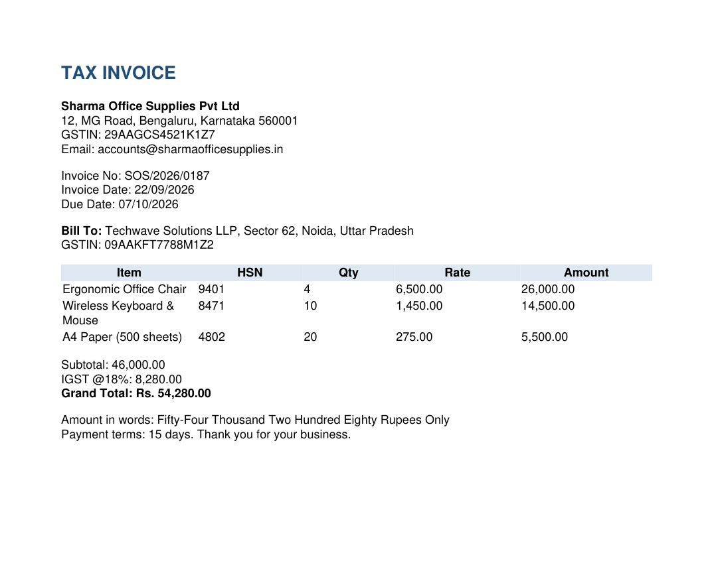
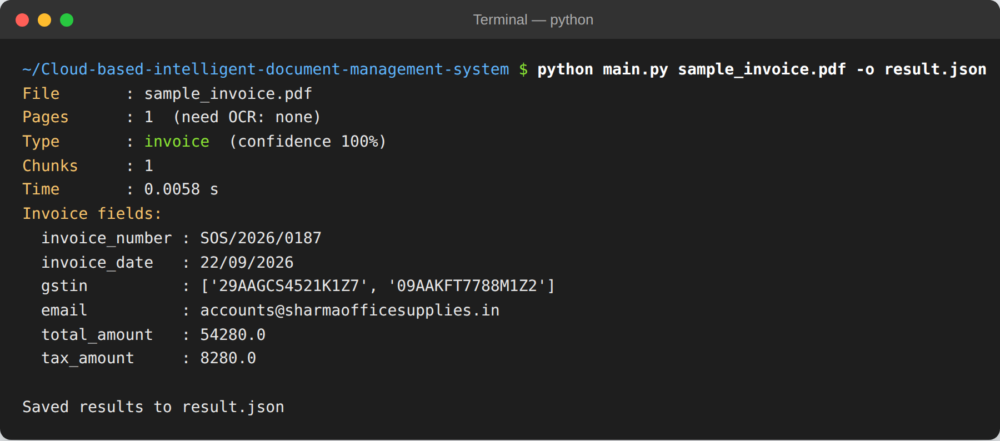
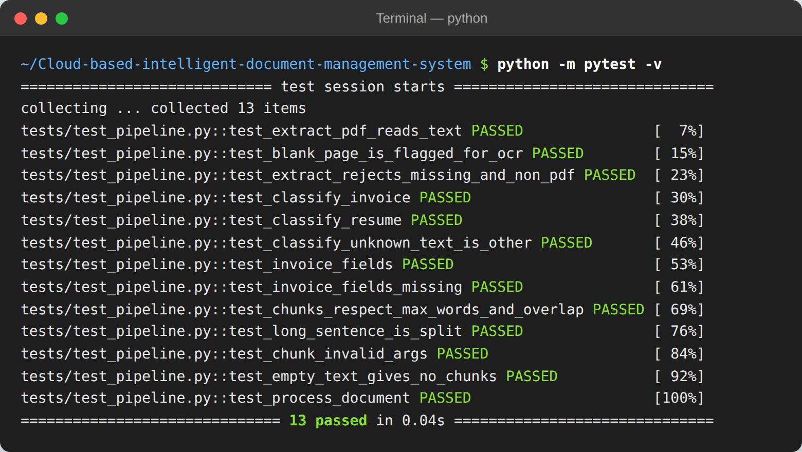

# Prototype Output Screenshots

### 1. Input – sample GST invoice

### 2. Output – fields extracted by `python main.py sample_invoice.pdf`

### 3. All 13 unit tests passing (`python -m pytest -v`)

